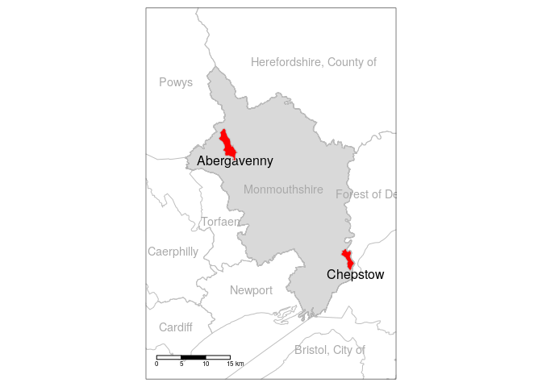

<!-- README.md is generated from README.Rmd. Please edit that file -->

```{r, include = FALSE}
knitr::opts_chunk$set(
  collapse = TRUE,
  comment = "#>",
  echo = FALSE,
  message = FALSE,
  warning = FALSE
)
library(tidyverse)
library(sf)
if(!file.exists("cyclemon.bib")) {
  download.file("https://github.com/Robinlovelace/cyclemon/releases/download/0.0.1/cyclemon.bib", "cyclemon.bib")
}
```

```{r, eval=FALSE}
# set-up
browseURL("~/projects/cyclemon/draft-active-travel-guidance.pdf") # welsh active travel guidance
readLines("~/projects/cyclemon/bid-spec.html")[1:30]
system("pandoc ~/projects/cyclemon/bid-spec.html -o bid-spec.md")
browseURL("README.pdf")
# citations
citr::tidy_bib_file(rmd_file = "README.Rmd", messy_bibliography = "~/uaf/allrefs.bib", file = "cyclemon.bib")
piggyback::pb_upload("cyclemon.bib")
piggyback::pb_download_url("cyclemon.bib")
```


<!-- badges: start -->
<!-- badges: end -->

<!-- This repo contains reproducible code to support the analysis of cycling potential in Monmouthshire, Wales. -->

# Introduction

There has much research on mode shift since the origins of applied transport planning and modelling in the 1950s [@boyce_forecasting_2015; @aguilera_passenger_2014].
Within this broad field of research uptake of active modes has become a focus of research.
A range of methods have been used to understand and model walking and cycling levels, with 'getting people cycling' being the topic of numerous papers during the 2010 [e.g. @beecham_visual_2012; @grise_if_2018; @larsen_build_2013; @raffler_cycling_2019; @zhang_prioritizing_2014].

Within the wide range of approaches used to model cycling uptake, two broad approaches have been particularly prominent in the literature.
The *origin-destination approach* relies on estimates of current travel behaviour, represented in origin-destination datasets reporting the number of trips, e.g. by mode of travel to work on a typical working day between residential zone origins and workplace destinations.
This approach was used in the Propensity to Cycle Tool (PCT), which was originally developed to support strategic cycle network planning based on commuter data for England [@lovelace_propensity_2017].
The 'PCT approach', which is a particular implementation of the 'origin-destination' approach that models cycling uptake in terms of 'distance-hilliness decay' functions (which can include other explanatory variables such as traffic levels) has subsequently been adapted to explore cycling potential in other contexts, including cycling uptake in US cities with low cycling levels [@ahmad_comparison_2020] and the potential for mode shift to cycling for the 'school commute' in across all state schools in England, with publicly available visualisations down to the street level [@goodman_scenarios_2019].

# Study area

The case study area is the local authority district of Monmouthshire, in rural South Wales (Figure \@ref(fig:case)).
The research took place in the context of the Welsh Active Travel Act [@welshgovernment_active_2020].

```{r, eval=FALSE}
remotes::install_github("robinlovelace/ukboundaries")
```

```{r, eval=FALSE}
uklads = ukboundaries::lad2018
# View(uklads %>% st_drop_geometry())
monmouthshire = uklads %>% filter(lau118nm == "Monmouthshire")
mapview::mapview(monmouthshire)
uk_codes = read_csv("~/hd/data/uk/codes/RGC_JUNE_2020_UK_v2.csv")
View(uk_codes)
```

```{r case, fig.cap="Case study area, with the parishes of Chepstow and Abergavenny highlighted in red."}

```


# Study area and data

```{r, eval=FALSE, echo=FALSE}
desire_lines_abergavenny = readRDS("input-data/school_data_desire_lines_chepstow.Rds")
mapview::mapview(desire_lines_abergavenny)
sf::write_sf(desire_lines_abergavenny, "desire_lines_abergavenny.geojson")
piggyback::pb_upload("desire_lines_abergavenny.geojson")
```

## Road network visualisation

```{r, eval=FALSE}
school_data_route_segments = readRDS("input-data/school_data_route_segments_balanced_chepstow.Rds")


system.time({
  rnet = stplanr::overline(sf::st_cast(school_data_route_segments, "LINESTRING"), "n")
})
br = c(0, 1, 2, 4, 8, 16, 32, 64)
plot(rnet, breaks = br)
plot(school_data_route_network["n"], breaks = br)
nrow(rnet)
nrow(school_data_route_network)
summary(rnet$n)
summary(school_data_route_network$n)

b_pct = c(0, 1, 2, 5, 10, 20, 50, 100, 500)

library(tmap)
tmap_mode("view")

tm_shape(rnet) +
  tm_lines(col = "n", breaks = b_pct,
           # lwd = "n",
           scale = 4,
           palette = "Blues") +
  tm_scale_bar()

saveRDS(school_data_route_segments, "input-data/school_data_route_segments_balanced_chepstow.Rds")

```


# References

