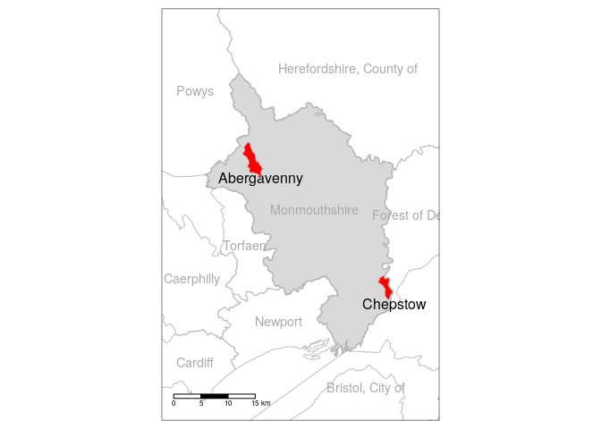
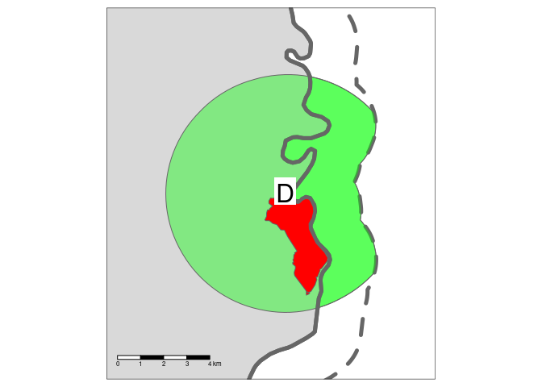

Combining origin-destination and spatial network approaches to estimate
walking and cycling potential
================

<!-- README.md is generated from README.Rmd. Please edit that file -->
<!-- badges: start -->
<!-- badges: end -->
<!-- This repo contains reproducible code to support the analysis of cycling potential in Monmouthshire, Wales. -->

# 1 Introduction

There has been much research on mode shift since the origins of applied
transport planning and modelling in the 1950s (Boyce and Williams 2015;
Aguil’era and Gr’ebert 2014). Within this broad field of research,
uptake of ‘active modes’ (walking and cycling) has become a recent focus
(Götschi et al. 2017). A range of methods have been used to understand
and model walking and cycling levels, with ‘getting people cycling’
being the topic of numerous papers during the 2010 (e.g. Beecham, Wood,
and Bowerman 2012; Gris’e and El-Geneidy 2018; Larsen, Patterson, and
El-Geneidy 2013; Raffler, Brezina, and Emberger 2019; Zhang, Magalhaes,
and Wang 2014).

Within the wide range of approaches used to model cycling uptake, two
broad approaches have been particularly prominent in the literature. The
*origin-destination approach* relies on estimates of current travel
behaviour, represented in origin-destination datasets reporting the
number of trips, e.g. by mode of travel to work on a typical working day
between residential zone origins and workplace destinations. This
approach was used in the Propensity to Cycle Tool (PCT), which was
originally developed to support strategic cycle network planning based
on commuter data for England (Lovelace et al. 2017). The ‘PCT approach,’
which is a particular implementation of the ‘origin-destination’
approach that models cycling uptake in terms of ‘distance-hilliness
decay’ functions (which can include other explanatory variables such as
traffic levels) has subsequently been adapted to explore cycling
potential in other contexts, including cycling uptake in US cities with
low cycling levels (Ahmad et al. 2020) and the potential for mode shift
to cycling for the ‘school commute’ in across all state schools in
England, with publicly available visualisations down to the street level
(Goodman et al. 2019).

The aim of this paper is to demonstrate the relative merits of the
‘origin-destination approach’ implemented in the PCT and the ‘spatial
network’ approach implemented in the open source sDNA software (Chan and
Cooper 2019). We do so using reproducible methods and open access input
data to encourage others to employ the techniques in other areas to
support evidence-based interventions to enable cycling uptake and as a
basis for future research and development.

# 2 Study area and input data

The case study area is the local authority district of Monmouthshire, in
rural South Wales (Figure <a href="#fig:case">2.1</a>). The research
took place in the context of the Welsh Active Travel Act (Welsh
Government 2020).

Figure 2.1: Case study area, with the parishes of Chepstow and
Abergavenny highlighted in red.

The main destinations of interest were schools and leisure centres.
These can be obtained from OpenStreetMap with the tags (key-value pairs)
`amenity=school` and `leisure=sports_centre`.

Other than destinations of interest, the other key input was the
boundary of the region responsible for the transport system in the local
area. We tested two approaches to define the ‘area of interest’ defining
the area within which routes were calculated: a simple buffer and a
three-stage buffering process, as illustrated in Figure
<a href="#fig:buffers">2.2</a>. The simple buffer approach involved
creating polygon with borders a fixed distance (5 km in the first
instance) around the destination (in this case the parishes of Chepstown
and Abergavenny). Model run times (and visualisation load times in
interactive maps) depend on the amount of data served, creating an
incentive reduce the size of the input data, and from a policy
perspective, it makes sense to focus on the area over which local
planners have control (and budget). In this context, the three-stage
process was developed as follows:

1.  Create a buffer around the zone of interest with a threshold
    distance (set to 5 km)
2.  Create a separate buffer around the region of interest to allow for
    some (more limited) inter-regional flow (set to 2 km)
3.  Calculate the intersection between the two buffers outlined in the
    previous stages

<!-- The advantages of the simple buffer approach included simplicity and minimisation of parameters that had to be hard-coded into the analysis.  -->
<!-- Taking both factors into account, we use the simple approach represented in the left hand plot of Figure <a href="#fig:buffers">2.2</a>, saving the three stage approach for contexts where it is advantageous to model cross-region flow but also to reduce the proportion of trips modelled crossing regional/state boundaries. -->
<!-- This process is now available as a function, ... in the package stplanr. -->

Figure 2.2: Illustration of the simple buffer and three stage buffering
approaches to identify areas of interest within which travel to
destinations in the zones could take place. The D represents the
desination of interest.

<!-- # Study area and data -->
<!-- ## Definition of travel watersheds -->
<!-- Explain how extent of analysis was computed (RL + CC) -->

Other than the school location and parish

# 3 Origin-destination analysis

Describe a generalised version of the ‘PCT approach’ with recent
modifications, improvements and areas for improvement (RL)

## 3.1 Origin-destination data processing

Talk about data availability, possibility of modelling OD data with SIMs
and od package (RL)

## 3.2 Routing: OD data

Different routing options (RL)

## 3.3 Estimating cycling uptake

Go Dutch and other options (RL)

# 4 Spatial network analysis

Explanation of the method and reproducible example (CC)

## 4.1 Spatial network processing

## 4.2 Network modelling

## 4.3 Scenario analysis

How the walking/cycling scenarios were implemented with sDNA (CC)

# 5 Integrated OD and SNA network analysis

RL + CC

## 5.1 Road network visualisation

# 6 Findings

RL + CC

# 7 Conclusions

RL + CC

# 8 References

Aguil’era, Anne, and Jean Gr’ebert. 2014. “Passenger Transport Mode
Share in Cities: Exploration of Actual and Future Trends with a
Worldwide Survey.” *International Journal of Automotive Technology and
Management* 14 (3-4): 203–16.
<https://doi.org/10.1504/IJATM.2014.065290>.

Ahmad, Sohail, Anna Goodman, Felix Creutzig, James Woodcock, and Marko
Tainio. 2020. “A Comparison of the Health and Environmental Impacts of
Increasing Urban Density Against Increasing Propensity to Walk and Cycle
in Nashville, USA.” *Cities & Health* 4 (1): 55–65.
<https://doi.org/10.1080/23748834.2019.1659667>.

Beecham, Roger, Jo Wood, and Audrey Bowerman. 2012. “A Visual Analytics
Approach to Understanding Cycling Behaviour.” In *2012 IEEE Conference
on Visual Analytics Science and Technology (VAST)*, 207–8. IEEE.

Boyce, David E., and Huw C. W. L. Williams. 2015. *Forecasting Urban
Travel: Past, Present and Future*. Edward Elgar Publishing.

Chan, Eric Yin Cheung, and Crispin HV Cooper. 2019. “Using Road Class as
a Replacement for Predicted Motorized Traffic Flow in Spatial Network
Models of Cycling.” *Scientific Reports* 9 (1): 1–12.

Goodman, Anna, Ilan Fridman Rojas, James Woodcock, Rachel Aldred,
Nikolai Berkoff, Malcolm Morgan, Ali Abbas, and Robin Lovelace. 2019.
“Scenarios of Cycling to School in England, and Associated Health and
Carbon Impacts: Application of the ‘Propensity to Cycle Tool’.” *Journal
of Transport & Health* 12 (March): 263–78.
<https://doi.org/10.1016/j.jth.2019.01.008>.

Götschi, Thomas, Audrey de Nazelle, Christian Brand, Regine Gerike, and
Regine Gerike. 2017. “Towards a Comprehensive Conceptual Framework of
Active Travel Behavior: A Review and Synthesis of Published Frameworks.”
*Current Environmental Health Reports* 4 (3): 286–95.
<https://doi.org/10.1007/s40572-017-0149-9>.

Gris’e, Emily, and Ahmed El-Geneidy. 2018. “If We Build It, Who Will
Benefit? A Multi-Criteria Approach for the Prioritization of New Bicycle
Lanes in Quebec City, Canada.” *Journal of Transport and Land Use* 11
(1). <https://doi.org/10.5198/jtlu.2018.1115>.

Larsen, Jacob, Zachary Patterson, and Ahmed El-Geneidy. 2013. “Build It.
But Where? The Use of Geographic Information Systems in Identifying
Locations for New Cycling Infrastructure.” *International Journal of
Sustainable Transportation* 7 (4): 299–317.

Lovelace, Robin, Anna Goodman, Rachel Aldred, Nikolai Berkoff, Ali
Abbas, and James Woodcock. 2017. “The Propensity to Cycle Tool: An Open
Source Online System for Sustainable Transport Planning.” *Journal of
Transport and Land Use* 10 (1). <https://doi.org/10.5198/jtlu.2016.862>.

Raffler, Clemens, Tadej Brezina, and Günter Emberger. 2019. “Cycling
Investment Expedience: Energy Expenditure Based Cost-Path Analysis of
National Census Bicycle Commuting Data.” *Transportation Research Part
A: Policy and Practice* 121 (March): 360–73.
<https://doi.org/10.1016/j.tra.2019.01.019>.

Welsh Government. 2020. “Active Travel Guidance.” Welsh Government.

Zhang, Dapeng, David Jose Ahouagi Vaz Magalhaes, and Xiaokun (Cara)
Wang. 2014. “Prioritizing Bicycle Paths in Belo Horizonte City, Brazil:
Analysis Based on User Preferences and Willingness Considering
Individual Heterogeneity.” *Transportation Research Part A: Policy and
Practice* 67: 268–78. <https://doi.org/10.1016/j.tra.2014.07.010>.

