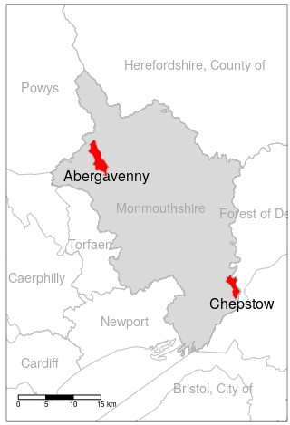
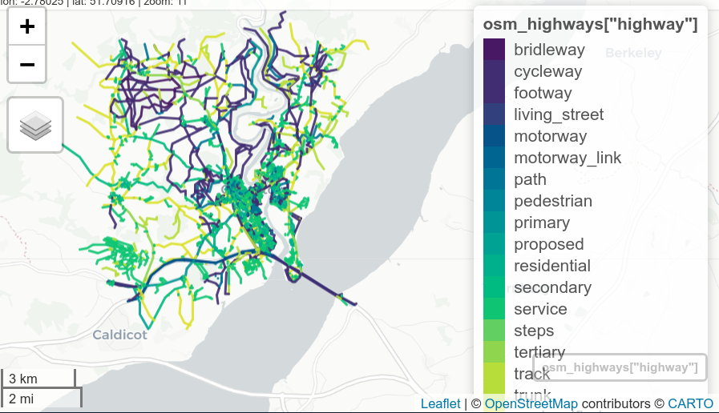

---
# # Shared content:
title: "An automated toolset for planning of walking and cycling networks serving specific destinations"
# title: Combining origin-destination and spatial network approaches to estimate walking and cycling potential
# title: "Modelling cycling potential to inform interventions in rural areas: insights from a case study of Monmouthshire, Wales"
# title: "Modelling active travel in rural areas: a combined origin-destination and spatial network approach to estimate walking and cycling potential and prioritise interventions"
bibliography: cyclemon.bib

# # # Generic outputs:
output:
  bookdown::github_document2:
  # bookdown::word_document2:
    number_sections: true
#   bookdown::github_document2:


# # JTLU version:
# # title: "Long Title for Journal of Transport and Land Use"
# # subtitle: "Subtitle"
# # shorttitle: "Short title"
# # output: jtludown::jtlu_article
# # to use bookdown cross references:
# author1: Robin Lovelace
# org1: University of Leeds
# author2: Crispin Cooper
# org2: University of Cardiff
# thanks: "r.lovelace@ leeds.ac.uk"
# abstract: |
#   Add your article abstract here,
#   test test test.
#   lots and lots
#   and lots and lots
#   of text.....................................
# output:
#  bookdown::pdf_book:
#    base_format: jtludown::jtlu_article
#    latex_engine: xelatex
   

---

<!-- README.md is generated from README.Rmd. Please edit that file -->

```{r, include = FALSE}
knitr::opts_chunk$set(
  collapse = TRUE,
  comment = "#>",
  echo = FALSE,
  message = FALSE,
  warning = FALSE,
  fig.align = "center"
)
library(tidyverse)
library(sf)
library(tmap)
if(!file.exists("cyclemon.bib")) {
  download.file("https://github.com/Robinlovelace/cyclemon/releases/download/0.0.1/cyclemon.bib", "cyclemon.bib")
}
```

```{r, eval=FALSE}
# set-up
browseURL("~/projects/cyclemon/draft-active-travel-guidance.pdf") # welsh active travel guidance
readLines("~/projects/cyclemon/bid-spec.html")[1:30]
system("pandoc ~/projects/cyclemon/bid-spec.html -o bid-spec.md")
browseURL("README.pdf")
# citations
# citr::tidy_bib_file(rmd_file = "README.Rmd", messy_bibliography = "~/uaf/allrefs.bib", file = "cyclemon.bib")
library(rbbt)
bbt_write_bib("paper/cyclemon.bib", bbt_detect_citations("paper/README.Rmd"), overwrite = TRUE)
```

```{r, engine='bash', eval=FALSE}
cp ~/repos/jtludown/inst/
cp README.pdf paper.pdf
cp README.docx paper.docx
```


<!-- badges: start -->

<!-- badges: end -->

<!-- This repo contains reproducible code to support the analysis of cycling potential in Monmouthshire, Wales. -->

\onecolumn
# Introduction

There has been much research on mode shift since the origins of applied transport planning and modelling in the 1950s [@boyce_forecasting_2015; @aguilera_passenger_2014]. Within this broad field of research, uptake of 'active modes' (walking and cycling) has become a recent focus [@gotschi_comprehensive_2017]. A range of methods have been used to understand and model walking and cycling levels, with 'getting people cycling' being the topic of numerous papers during the 2010 [e.g. @beecham_visual_2012; @grise_if_2018; @larsen_build_2013; @raffler_cycling_2019; @zhang_prioritizing_2014].
Likewise, getting people walking is worthwhile on environmental [@cervero_travel_1997; @frank_impacts_1994], community cohesion and health grounds [@handy_critical_2005; @handy_how_2002].
Recently there has been an increase in research activity on various pedestrian models supporting uptake of walking [@aoun_bicycle_2015; @cooper_using_2019; @ewing_varying_2014; @griswold_pedestrian_2019; @kuzmyak_estimating_2014; @martinez-gil_modeling_2017; @munira_use_2017; @turner_synthesis_2017].

Recent policy interest has been shown in planning active transportation networks for specific destinations, such as schools and major employers [@larouche_built_2015; @uttley_cycling_2016].
Encouraging active travel is not just about network infrastructure but complete package of policies, promotion, education, incentives, facilities at destinations [@forsyth_urban_2011; @handy_promoting_2014; @mccormack_search_2011; @pucher_walking_2010].
Within this context the specific-destination approach allows for more focused management of the ‘complete package’ as relevant to that destination.
However, modelling active travel potential to specific destinations should not neglect consideration of, and the potential for new infrastructure to integration with, wider walking and cycling networks [@forsyth_urban_2011].
It is difficult, in planning practice, to create calibrated models of walking and cycling behaviour, for the following reasons: 

1. Models of active modes of transportation are underdeveloped compared to vehicular models
2. The small scale of trips makes them sensitive to small scale features of the network. These can include: minor streets (often excluded from vehicle models altogether yet essential for active models); a greater variety of origin/destination points (not only zone centroids or a limited set of representative points within each zone, as with vehicular models); features such as cycle lane, sidewalk and footpath locations and condition, route attractiveness (as measured by e.g. green vegetation) and street lighting, none of which are reliably mapped.
3. The case of cycling suffers from an additional challenge, in that current levels of uptake are low. It is reasonable to assume that as uptake increases, cultural and safety-in-numbers effects may create significant nonlinearity in the response of cycling mode share to cycling infrastructure, as has already happened in e.g. Holland and Denmark, yet we lack the data to calibrate this [@hollander_transport_2016].
4. Reliable, recent local data on mode choice and flows is often not available. 
5. Finally, the funds invested in construction of active transportation networks --- and hence also in their modelling --- are low compared to typical spending on vehicular networks and their models.

These challenges notwithstanding, two broad approaches to modelling cycling uptake have been particularly prominent in the literature.
<!-- Comment from CC: I think better not to categorize Go Dutch as an O_D model here, firstly because we’re not comparing to spatial network analysis, secondly because in context of ‘specific destination’ planning (or whatever we call it) it’s going to get confusing -->
<!-- Maybe better here to explain how Go Dutch addresses point 3 above? -->
<!-- Todo: what did you mean by "This approach" in the tracked changes Crispin? (RL) -->
The *origin-destination approach* relies on estimates of current travel behaviour, represented in origin-destination datasets reporting the number of trips, e.g. by mode of travel to work on a typical working day between residential zone origins and workplace destinations. This approach was used in the Propensity to Cycle Tool (PCT), which was originally developed to support strategic cycle network planning based on commuter data for England [@lovelace_propensity_2017]. The 'PCT approach', which is a particular implementation of the 'origin-destination' approach that models cycling uptake in terms of 'distance-hilliness decay' functions (which can include other explanatory variables such as traffic levels) has subsequently been adapted to explore cycling potential in other contexts, including cycling uptake in US cities with low cycling levels [@ahmad_comparison_2020] and the potential for mode shift to cycling for the 'school commute' in across all state schools in England, with publicly available visualisations down to the street level [@goodman_scenarios_2019].
The PCT has been used by the majority of highway authorities to inform strategic network prioritisation across England [@lovelace_open_2020].^[
See the 'PCT Impact' report (Nov 2020) and many case studies of the use of the PCT in practice at https://www.pct.bike/manual.html. 
An indication of the level of use of the PCT by local, regional and national government can be obtained by searching for "propensity to cycle tool" on web pages hosted on the .gov.uk on services such as [Google](https://www.google.com/search?channel=fs&q=site%3A.gov.uk+%22propensity+to+cycle+tool%22).
At the time of writing the search yielded 814 results, many of which document how the PCT has been used to support Local Cycling and Walking Investment Plans.
]
The Rapid Cycleway Prioritisation Tool, which was developed as an extension to the PCT during COVID-19-induced lockdown and subsequent reduction in usage of public transport and peak hour motor traffic to help local authorities prioritise road space reallocation schemes [@lovelace_methods_2020], has also been widely used.^[
A Department for Transport survey of local authority bids to the Active Travel Fund indicated that 75% of non-London local authorities used the PCT or Rapid cycleway prioritisation tool to inform and prioritise their proposed schemes (Department for Transport, personal communication). 
]
The PCT approach is not without limitations:
it omits walking and cannot be used to assess the impacts of existing and potential future infrastructure interventions on mode choice.
Furthermore, detailed origin-destination data is only available from the 10-yearly census, making the data on which the PCT is based increasingly out-of-date.

<!-- Here I will introduce spatial network analysis (Chan & Cooper, 2019; Cooper, 2017, 2018). -->
An alternative approach is to use the topology of the transport network as the basis of modelling using spatial network analysis (SNA) techniques [@chan_using_2019; @cooper_predictive_2018; @cooper_cycletopia_2017].
Within the context of the above challenges, this paper introduces an automated toolchain to assist in production of planning aids for active transportation focused on specific destinations but also highlighting integration with the wider network.
The approach of automation keeps the expense of deployment realistic for active transportation budgets. Given the challenges of reliable prediction of walking and cycling mode choice and flows, the aim at this stage is not to produce calibrated predictions, but to visualize likely walking and cycling behaviours within settlements in a manner useful to the planning process. 
We do so using reproducible methods and open access input data to encourage others to employ the techniques in other areas to support evidence-based interventions to enable cycling uptake and as a basis for future research and development.

<!-- Should we mention the aim of the paper? Previously it was: (RL) -->
<!-- The aim of this paper is to demonstrate the relative merits of the 'origin-destination approach' implemented in the PCT and the 'spatial network' approach implemented in the open source sDNA software [@chan_using_2019]. -->
<!-- We do so using reproducible methods and open access input data to encourage others to employ the techniques in other areas to support evidence-based interventions to enable cycling uptake and as a basis for future research and development. -->

# Study area and input data

```{r}
uklads = ukboundaries::lad2018
# View(uklads %>% st_drop_geometry())
monmouthshire = uklads %>% filter(lau118nm == "Monmouthshire")
```


The case study area is the local authority district of Monmouthshire, in rural South Wales (Figure \@ref(fig:case)). The research took place in the context of the Welsh Active Travel Act [@welshgovernment_active_2020].

```{r, eval=FALSE}
remotes::install_github("robinlovelace/ukboundaries")
```

```{r case, fig.cap="Case study area, with the parishes of Chepstow and Abergavenny highlighted in red.", out.width="40%"}
# fig.env='figure*',

```

The main destinations of interest were schools and leisure centres.
These can be obtained from OpenStreetMap with the tags (key-value pairs) `amenity=school` and `leisure=sports_centre`.

```{r, eval=FALSE}
# run code once to get schools data
library(osmdata)
osm_schools = opq(sf::st_bbox(monmouthshire)) %>% 
  add_osm_feature(key = "amenity", value = "school") %>% 
  osmdata_sf()
osm_leisure = opq(sf::st_bbox(monmouthshire)) %>% 
  # add_osm_feature(key = "leisure", value = "sports_centre") %>% # few responses
  add_osm_feature(key = "leisure") %>% 
  osmdata_sf()

saveRDS(osm_schools, "osm_schools_list_monmouthshire.Rds")
saveRDS(osm_leisure, "osm_leisure_list_monmouthshire.Rds")
```

```{r}
u = "https://github.com/Robinlovelace/cyclemon/releases/download/0.0.1/osm_schools_list_monmouthshire.Rds"
f = basename(u)
if(!file.exists(f)) download.file(url = u, destfile = f)
osm_schools = readRDS(f)

u = "https://github.com/Robinlovelace/cyclemon/releases/download/0.0.1/osm_leisure_list_monmouthshire.Rds"
f = basename(u)
if(!file.exists(f)) download.file(url = u, destfile = f)
osm_leisure = readRDS(f)

osm_schools_poly = osm_schools$osm_polygons %>% 
  select(osm_id, name)
osm_leisure_poly = osm_leisure$osm_polygons %>% 
  select(osm_id, name)
# mapview::mapview(osm_leisure_poly)
# mapview::mapview(osm_schools_poly)
chepstow_comp = osm_schools_poly %>% 
  filter(str_detect(string = name, pattern = "Chepstow Comp")) 
```

Other than destinations of interest, the other key input was the boundary of the region responsible for the transport system in the local area.
<!-- Todo: resolve this comment (CC): -->
<!-- I haven’t buffered in this way – I’m still reluctant to discard out-of-region flows (although I do cut everything off at the severn bridge) -->
<!-- From a data quantity perspective I have fixed a lot of issues in recent automation. Turns out OSM had a lot of pseudonodes leading to much higher link counts than necessary especially after running through my sidewalk tool. These are fixed now.  -->
<!-- We tested two approaches to define the 'area of interest' defining the area within which routes were calculated: a simple buffer and a three-stage buffering process, as illustrated in Figure \@ref(fig:buffers). -->
<!-- The simple buffer approach involved creating polygon with borders a fixed distance (5 km in the first instance) around the destination (in this case the parishes of Chepstown and Abergavenny). -->
<!-- Model run times (and visualisation load times in interactive maps) depend on the amount of data served, creating an incentive reduce the size of the input data, and from a policy perspective, it makes sense to focus on the area over which local planners have control (and budget). -->
<!-- In this context, the three-stage process was developed as follows: -->

<!-- 1. Create a buffer around the zone of interest with a threshold distance (set to 5 km) -->
<!-- 2. Create a separate buffer around the region of interest to allow for some (more limited) inter-regional flow (set to 2 km) -->
<!-- 3. Calculate the intersection between the two buffers outlined in the previous stages -->

<!-- The advantages of the simple buffer approach included simplicity and minimisation of parameters that had to be hard-coded into the analysis.  -->
<!-- Taking both factors into account, we use the simple approach represented in the left hand plot of Figure \@ref(fig:buffers), saving the three stage approach for contexts where it is advantageous to model cross-region flow but also to reduce the proportion of trips modelled crossing regional/state boundaries. -->

<!-- This process is now available as a function, ... in the package stplanr. -->

```{r buffers, eval=TRUE, fig.cap="Illustration of the simple buffer and three stage buffering approaches to identify areas of interest within which travel to destinations in the zones could take place. The D represents the desination of interest.", out.width="49%", fig.show='hold'}
chepstow = sf::read_sf("../input-data/chepstow.geojson")
# aim: generate buffers (update stplanr)
# chepstow_buffer = stplanr::geo_buffer(chepstow, dist = 10000) # fails
buffer_dist = 5000
region_buffer_dist = 2000 
zone_buffer = chepstow_comp %>% 
  sf::st_transform(27700) %>% 
  sf::st_buffer(buffer_dist) %>% 
  sf::st_transform(4326)
region_buffer = monmouthshire %>% 
  sf::st_transform(27700) %>% 
  sf::st_buffer(region_buffer_dist) %>% 
  sf::st_transform(4326)
zone_buffer_in_region = sf::st_intersection(zone_buffer, region_buffer)

# tm_shape(zone_buffer, bbox = tmaptools::bb(zone_buffer, 1.5)) +
#   tm_polygons(col = "green", alpha = 0.4) +
#   tm_shape(monmouthshire) +
#   tm_polygons(lwd = 5) + 
#   tm_shape(region_buffer) +
#   tm_borders(lwd = 5, lty = 2) +
#   tm_shape(zone_buffer) +
#   tm_polygons(col = "green", alpha = 0.4) +
#   tm_shape(monmouthshire) +
#   tm_borders(lwd = 5) +
#   tm_shape(chepstow) +
#   tm_polygons(col = "red") +
#   tm_scale_bar(position = "left") +
#   qtm(chepstow_comp %>% mutate(txt = "D")) + tm_text("txt", bg.color = "white", size = 2)
# 
# tm_shape(zone_buffer_in_region, bbox = tmaptools::bb(zone_buffer_in_region, 1.5)) +
#   tm_polygons(col = "green", alpha = 0.4) +
#   tm_shape(monmouthshire) +
#   tm_polygons(lwd = 5) + 
#   tm_shape(region_buffer) +
#   tm_borders(lwd = 5, lty = 2) +
#   tm_shape(zone_buffer_in_region) +
#   tm_polygons(col = "green", alpha = 0.4) +
#   tm_shape(monmouthshire) +
#   tm_borders(lwd = 5) +
#   tm_shape(chepstow) +
#   tm_polygons(col = "red") +
#   tm_scale_bar(position = "left") +
#   qtm(chepstow_comp %>% mutate(txt = "D")) + tm_text("txt", bg.color = "white", size = 2)

# mapview::mapview(chepstow_buffer_in_region)
# plot(chepstow)
# abber = readRDS("../input-data/abergavenny.geojson")
```


<!-- # Study area and data -->

```{r, eval=FALSE, echo=FALSE}
desire_lines_abergavenny = readRDS("../input-data/school_data_desire_lines_chepstow.Rds")
mapview::mapview(desire_lines_abergavenny)
sf::write_sf(desire_lines_abergavenny, "desire_lines_abergavenny.geojson")
piggyback::pb_upload("desire_lines_abergavenny.geojson")
```

<!-- ## Definition of travel watersheds -->

<!-- Explain how extent of analysis was computed (RL + CC) -->

A key input is origin-destination (OD) data.
OD data can be obtained from a number of sources, the most reliable being a list of geocoded addresses or postcodes associated with people who visit each destination regularly.
In cases where OD datasets derived from from surveys or official/commercial records are missing, they can be simulated using a range of techniques.
For the purposes of this paper, to enable full reproducibility, we simulate origins by sampling from buildings in the study area, as illustrated below.

```{r, eval=FALSE}
# Aim: get OSM buildings and sample from them
library(osmextract)
osm_buildings = oe_get(chepstow_comp, layer = "multipolygons")
names(osm_buildings)
osm_buildings_in_region = osm_buildings[zone_buffer, ] %>% 
  # filter(building == "residential") %>% # too few
  filter(str_detect(string = building, pattern = "resi|yes|house")) %>% # too few
  select(osm_id, name, building)
mapview::mapview(osm_buildings_in_region)
```

```{r, eval=FALSE}
# try getting the data from worldpop
remotes::install_github("wpgp/wpgpDownloadR")
library(wpgpDownloadR)
countries = wpgpListCountries()
wpgpListCountryDatasets("GBR")
df = wpgpGetCountryDataset(ISO3 = "GBR", covariate = "ppp_2020")
df
library(raster)
r = raster(df)
r_local = raster::crop(r, zone_buffer)

# export to shapefile
plot(r_local)
r_local_stars = stars::st_as_stars(r_local)
plot(r_local_stars)
r_local_sf = sf::st_as_sf(r_local_stars)
plot(r_local_sf)
dir.create("worldpop-chepstow")
sf::write_sf(r_local_sf, "worldpop-chepstow/r_local_sf.shp")
zip("worldpop-chepstow.zip", "worldpop-chepstow")
piggyback::pb_upload("worldpop-chepstow.zip")
piggyback::pb_download_url("worldpop-chepstow.zip")

r_points = raster::rasterToPoints(r_local)
r_points_df = data.frame(r_points)
summary(r_points_df$gbr_ppp_2020)
sum(r_points_df$gbr_ppp_2020) # 23k ppl = reasonable

# dfx = read_csv("../cyclemonData/cleaned-data/abergavenny-school-origins.csv")
# dfx

r_points_sf = sf::st_as_sf(r_points_df, coords = c("x", "y"), crs = 4326)
r_points_region = r_points_sf[zone_buffer, ]
mapview::mapview(r_points_region) # works ~100m resolution
nrow(r_points_region) # 13k
pop_dest = 1000
r_points_region$pop_od = r_points_region$gbr_ppp_2020 / (sum(r_points_region$gbr_ppp_2020) / pop_dest)

# integerise
# https://spatial-microsim-book.robinlovelace.net/smsimr.html#sintegerisation
int_trs <- function(x){
  # For generalisation purpose, x becomes a vector
  xv <- as.vector(x) # allows trs to work on matrices
  xint <- floor(xv) # integer part of the weight
  r <- xv - xint # decimal part of the weight
  def <- round(sum(r)) # the deficit population
  # the weights be 'topped up' (+ 1 applied)
  topup <- sample(length(x), size = def, prob = r)
  xint[topup] <- xint[topup] + 1
  dim(xint) <- dim(x)
  dimnames(xint) <- dimnames(x)
  xint
}

r_points_region$pop_trs = int_trs(r_points_region$po)
table(r_points_region$pop_trs)
sum(r_points_region$pop_trs)
r_points_integer = r_points_region %>% 
  filter(pop_trs > 0)
mapview::mapview(r_points_integer)
saveRDS(r_points_integer, "r_points_integer.Rds")
piggyback::pb_upload("r_points_integer.Rds")
piggyback::pb_download_url("r_points_integer.Rds")
```

```{r, fig.cap="Origin-destination data, represented as 'desire lines' emanating from residential origins with the destination fixed to the destination."}
u = "https://github.com/Robinlovelace/cyclemon/releases/download/0.0.1/r_points_integer.Rds"
f = basename(u)
if(!file.exists(f)) download.file(url = u, destfile = f)
r_points_integer = readRDS("r_points_integer.Rds")
r_od = r_points_integer %>% 
  mutate(o = seq(nrow(r_points_integer)), d = chepstow_comp$name) %>% 
  dplyr::select(o, d, n = pop_trs)
od = r_od %>% sf::st_drop_geometry()
desire_lines = od::od_to_sf(od, r_od, zd = chepstow_comp %>% dplyr::select(name))
tm_shape(zone_buffer_in_region, bbox = tmaptools::bb(zone_buffer_in_region, 1.5)) +
  tm_fill(col = NA, alpha = 0) +
  tm_shape(monmouthshire) +
  tm_polygons(lwd = 5) + 
  # tm_shape(region_buffer) +
  # tm_borders(lwd = 5, lty = 2) +
  # tm_shape(zone_buffer_in_region) +
  # tm_polygons(col = "green", alpha = 0.4) +
  tm_shape(monmouthshire) +
  tm_borders(lwd = 5) +
  tm_shape(chepstow) +
  tm_polygons(col = "red") +
  tm_scale_bar(position = "left") +
  qtm(chepstow_comp %>% mutate(txt = "D")) + tm_text("txt", bg.color = "white", size = 2) +
  tm_shape(desire_lines) +
  tm_lines(lwd = "n", scale = 0.3, alpha = 0.2, legend.lwd.show = FALSE)
```

The other key input, for spatial network analysis, is route network data.
This can be obtained from OpenStreetMap, which has global coverage (although quality varies).
The OSM data for the study area is represented in Figure \@ref(fig:osminput).

```{r, eval=FALSE, echo=FALSE}
library(osmdata)
bb = sf::st_bbox(desire_lines)
osm_data_all = opq(bbox = bb) %>% 
  add_osm_feature(key = "highway") %>% 
  osmdata_sf()
plot(osm_data_all$osm_lines)
osm_highways = osm_data_all$osm_lines
mapview::mapview(osm_highways["highway"])
osm_highways$highway_simple = trafficalmr::
```

```{r osminput, fig.cap="OSM data for the study area (placeholder - RL to update)"}

```


<!-- ## Estimating cycling uptake -->

<!-- Go Dutch and other options (RL) -->

# Spatial network analysis

Explanation of the method and reproducible example (CC)

## Spatial network processing

## Network modelling

## Scenario analysis

How the walking/cycling scenarios were implemented with sDNA (CC)

# Integrated OD and SNA network analysis

RL + CC

## Road network visualisation

```{r, eval=FALSE}
school_data_route_segments = readRDS("../input-data/school_data_route_segments_balanced_chepstow.Rds")


system.time({
  rnet = stplanr::overline(sf::st_cast(school_data_route_segments, "LINESTRING"), "n")
})
br = c(0, 1, 2, 4, 8, 16, 32, 64)
plot(rnet, breaks = br)
plot(school_data_route_network["n"], breaks = br)
nrow(rnet)
nrow(school_data_route_network)
summary(rnet$n)
summary(school_data_route_network$n)

b_pct = c(0, 1, 2, 5, 10, 20, 50, 100, 500)

library(tmap)
tmap_mode("view")

tm_shape(rnet) +
  tm_lines(col = "n", breaks = b_pct,
           # lwd = "n",
           scale = 4,
           palette = "Blues") +
  tm_scale_bar()

saveRDS(school_data_route_segments, "../input-data/school_data_route_segments_balanced_chepstow.Rds")

```

# Findings

RL + CC

# Conclusions

RL + CC

# References

