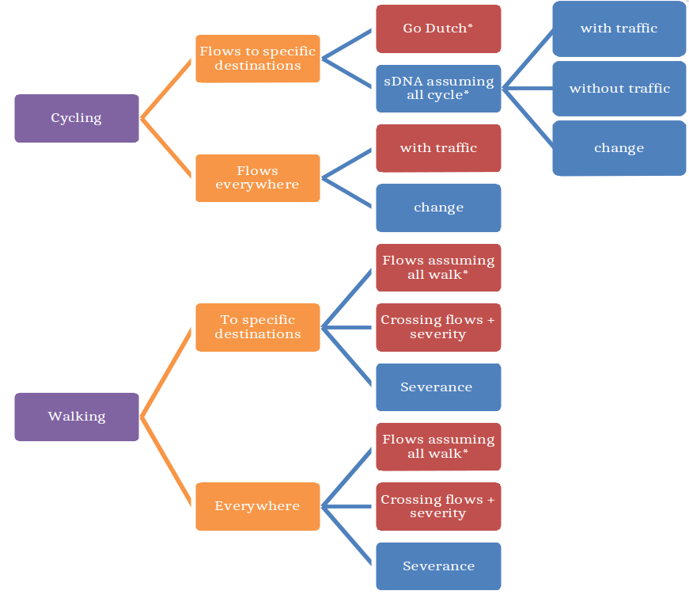

An automated toolset for planning of walking and cycling networks
serving specific destinations
================

<!-- README.md is generated from README.Rmd. Please edit that file -->

# 1 Introduction

There has been much research on mode shift since the origins of applied
transport planning and modelling in the 1950s (Boyce and Williams 2015;
Aguiléra and Grébert 2014). Within this broad field of research, uptake
of ‘active modes’ (walking and cycling) has become a recent focus
(Götschi et al. 2017). A range of methods have been used to understand
and model walking and cycling levels, with ‘getting people cycling’
being the topic of numerous papers during the 2010 (e.g. Beecham, Wood,
and Bowerman 2012; Grisé and El-Geneidy 2018; Larsen, Patterson, and
El-Geneidy 2013; Raffler, Brezina, and Emberger 2019; Zhang, Magalhaes,
and Wang 2014). Likewise, getting people walking is worthwhile on
environmental (Cervero and Kockelman 1997; Frank and Pivo 1994),
community cohesion and health grounds (Handy 2005; Handy et al. 2002).
Recently there has been an increase in research activity on various
pedestrian models supporting uptake of walking (Aoun 2015; Cooper et al.
2019; Ewing et al. 2014; Griswold et al. 2019; Kuzmyak et al. 2014;
Martinez-Gil, Lozano, and Fernández 2017; Munira and Sener 2017; Turner
2017).

Recent policy interest has been shown in planning active transportation
networks for specific destinations, such as schools and major employers
(Larouche 2015; Uttley and Lovelace 2016). Encouraging active travel is
not just about network infrastructure but complete package of policies,
promotion, education, incentives, facilities at destinations (Forsyth
and Krizek 2011; Handy, van Wee, and Kroesen 2014; McCormack and Shiell
2011; Pucher et al. 2010). Within this context the specific-destination
approach allows for more focused management of the ‘complete package’ as
relevant to that destination. However, modelling active travel potential
to specific destinations should not neglect consideration of, and the
potential for new infrastructure to integration with, wider walking and
cycling networks (Forsyth and Krizek 2011). It is difficult, in planning
practice, to create calibrated models of walking and cycling behaviour,
for the following reasons:

1.  Models of active modes of transportation are underdeveloped compared
    to vehicular models
2.  The small scale of trips makes them sensitive to small scale
    features of the network. These can include: minor streets (often
    excluded from vehicle models altogether yet essential for active
    models); a greater variety of origin/destination points (not only
    zone centroids or a limited set of representative points within each
    zone, as with vehicular models); features such as cycle lane,
    sidewalk and footpath locations and condition, route attractiveness
    (as measured by e.g. green vegetation) and street lighting, none of
    which are reliably mapped.
3.  The case of cycling suffers from an additional challenge, in that
    current levels of uptake are low. It is reasonable to assume that as
    uptake increases, cultural and safety-in-numbers effects may create
    significant nonlinearity in the response of cycling mode share to
    cycling infrastructure, as has already happened in e.g. Holland and
    Denmark, yet we lack the data to calibrate this (Hollander 2016).
4.  Reliable, recent local data on mode choice and flows is often not
    available.
5.  Finally, the funds invested in construction of active transportation
    networks — and hence also in their modelling — are low compared to
    typical spending on vehicular networks and their models.

These challenges notwithstanding, two broad approaches to modelling
cycling uptake have been particularly prominent in the literature.
<!-- Comment from CC: I think better not to categorize Go Dutch as an O_D model here, firstly because we’re not comparing to spatial network analysis, secondly because in context of ‘specific destination’ planning (or whatever we call it) it’s going to get confusing -->
<!-- Maybe better here to explain how Go Dutch addresses point 3 above? -->
<!-- Todo: what did you mean by "This approach" in the tracked changes Crispin? (RL) It's calling PCT an origin-destination approach as it uses an OD dataset for input. see revision below.  -->
The *origin-destination approach* relies on estimates of current travel
behaviour, represented in origin-destination datasets reporting the
number of trips, e.g. by mode of travel to work on a typical working day
between residential zone origins and workplace destinations. This
approach was used to generate baselines for the the Propensity to Cycle
Tool (PCT), which was originally developed to support strategic cycle
network planning based on commuter data for England (Lovelace et al.
2017). The ‘PCT approach’, which is a particular implementation of the
‘origin-destination’ approach that models cycling uptake in terms of
‘distance-hilliness decay’ functions (which can include other
explanatory variables such as traffic levels) has subsequently been
adapted to explore cycling potential in other contexts, including
cycling uptake in US cities with low cycling levels (Ahmad et al. 2020)
and the potential for mode shift to cycling for the ‘school commute’ in
across all state schools in England, with publicly available
visualisations down to the street level (Goodman et al. 2019). The PCT
has been used by the majority of highway authorities to inform strategic
network prioritisation across England (R. Lovelace, Parkin, and Cohen
2020).\[1\] The Rapid Cycleway Prioritisation Tool, which was developed
as an extension to the PCT during COVID-19-induced lockdown and
subsequent reduction in usage of public transport and peak hour motor
traffic to help local authorities prioritise road space reallocation
schemes (R. Lovelace et al. 2020), has also been widely used.\[2\] The
PCT approach is not without limitations: it omits walking and cannot be
used to assess the impacts of existing and potential future
infrastructure interventions on mode choice. Furthermore, detailed
origin-destination data is only available from the 10-yearly census,
making the data on which the PCT is based increasingly out-of-date.

An alternative approach is to use the topology of the transport network
as the basis of modelling using spatial network analysis (SNA)
techniques (Chan and Cooper 2019; Cooper 2018; J. Cooper and Leahy
2017). Historically, SNA analysis has been done without
origin-destination data, something that can be considered a strength —
because data requirements are reduced — yet also a weakness:
origin-destination data can provide useful information about travel
behaviour that networks alone do not reveal.

Within the context of the above challenges, this paper introduces an
automated toolchain to assist in production of planning aids for active
transportation focused on specific destinations but also highlighting
integration with the wider network. Instead of requiring comprehensive
origin-destination data, the approach can leverage single-destination
data which is generally available from organizations keen to support
active travel planning efforts and more up-to-date then Census data. The
approach was originally developed for Monmouthshire County Council who,
like most local authorities across the UK and many local government
organisations worldwide, hold data on journeys to public schools and
leisure centres. Specific-destination models for cycling were developed
using the PCT approach, while specific-destination models for walking
were incorporated into the SNA approach. In addition to showing
specific-destination models, however, network-only SNA models are also
employed to highlight integration of specific-destination routes with
the wider active travel network, the importance of which is highlighted
by Forsyth and Krizek (2011).

Considering the challenges associated with accurate prediction and
monitoring of walking and cycling mode choice and flows, the aim was not
to produce calibrated predictions. Instead, the aim was to estimate and
visualize potential walking and cycling behaviours to support the
planning process. The approach maintains simplicity by deliberately
omitting recalibration (the process of updating model results following
monitoring): instead it re-uses coefficients describing cycling and
walking behaviour calculated in previous research.

<!-- Comment: Some of this could be added to the conclusions (rl) if we have any (cc) -->

As discussed in the final section, the simplicity of the
single-destination has several advantages: it keeps modelling costs low,
enables transparency of modelling assumptions, and gives users of the
outputs the information they need to determine whether unexpected
outputs are (a) due to unmet modelling assumptions, or (b) indicative of
valid areas of concern in future network plans. That said, in most
cases, modelling outputs showed strong alignment with networks
previously planned on the basis of local knowledge.

The approach of automation keeps the expense of deployment realistic for
active transportation budgets. We do so with reproducible methods and
open access input data to encourage others to employ the techniques in
other areas to support evidence-based interventions to enable cycling
uptake and as a basis for future research and development.

<!-- Should we mention the aim of the paper? Previously it was: (RL) -->

<!-- The aim of this paper is to demonstrate the relative merits of the 'origin-destination approach' implemented in the PCT and the 'spatial network' approach implemented in the open source sDNA software [@chan_using_2019]. -->

<!-- We do so using reproducible methods and open access input data to encourage others to employ the techniques in other areas to support evidence-based interventions to enable cycling uptake and as a basis for future research and development. -->

# 2 Study area and input data

The case study area is the local authority district of Monmouthshire, in
rural South Wales (Figure <a href="#fig:buffers">2.1</a> left). The
research took place in the context of the Active Travel (Wales) Act
2013, which requires local authorities to prepare and submit strategic
walking and cycling network plans for approval by the devolved national
government (Welsh Government 2020).

Figure 2.1: Illustration of the study area (left) and origin-destination
data, represented as desire lines emanating from residential origins
with the destination fixed to the destination, simulated from WorldPop
data to the destination (right).

<!-- # Study area and data -->

<!-- ## Definition of travel watersheds -->

<!-- Explain how extent of analysis was computed (RL + CC) -->

The destinations of interest for which travel data was available were
schools and leisure centres. For the purposes of this paper, the
locations of these destinations were obtained from OpenStreetMap with
the tags (key-value pairs) `amenity=school` and `leisure=sports_centre`.
\[Add to Figure <a href="#fig:buffers">2.1</a> ?\]

The main input dataset was a list of postcodes associated with each
destination which, after being geocoded, were converted into
origin-destination (OD) data. **\[Todo, add table showing what this
looks like with specific OD pairs linked to a map?\]** The other key
input was the boundary of the region responsible for the transport
system in the local area, available from the UK’s official open data web
repository data.gov.uk.

Data on approximate locations from which people travel regularly to a
particular destination can be obtained from a number of sources, the
most reliable being a list of anonymous geocoded addresses or postcodes
associated with people who visit each destination regularly. In cases
where such datasets, derived from routine databases surveys or
official/commercial records, are missing, they can be simulated using a
range of techniques. For the purposes of this paper, records of the
number of people travelling from each postcode to each destination is
confidential. To enable full reproducibility to demonstrate the methods,
we simulate origins using WorldPop data (Tatem 2017), resulting in
desire lines illustrated in Figure <a href="#fig:buffers">2.1</a>
right.\[3\]

The other key input, for spatial network analysis, is route network
data. This can be obtained from OpenStreetMap, which has global coverage
(although quality varies). The OSM data for the study area is
represented in Figure <a href="#fig:osminput">2.2</a>. Terrain data was
included by draping the OSM network over a digital elevation model
constructed from the open licensed Ordnance Survey Terrain 50 data (open
access digital elevation data is available for most places, although not
at the 50 m resolution used in this study).

Figure 2.2: OSM data for the study area (placeholder - RL to update)

# 3 Methods

Figure <a href="#fig:flowchart">3.1</a> shows a summary of the modelling
layers output from our toolchain; these are described in greater detail
below. Feedback from planners indicated a need for a simplified set of
outputs, therefore we also identified key layers to be included in two
summaries (one for walking, one for cycling) — key layers are identified
in red in Figure <a href="#fig:flowchart">3.1</a>.

Figure 3.1: Hierarchy of modelling outputs, with key layers (those
included in walking/cycling summaries) shown in red.

## 3.1 Cycling models

Cycling models are presented both from the PCT approach and via a SpNA
approach. SpNA (spatial network analysis) is realized through use of the
sDNA (spatial design network analysis) software (Cooper and Chiaradia
2020). It should be noted that these two approaches each define
‘potential’ differently:

\-PCT Go Dutch views potential as an ideal/target scenario with no
traffic, and where overall cycling levels match those in Holland -sDNA
models assume people cycle all trips under a threshold ‘perceived
distance’. Presence/absence of motorized traffic has an impact on
cyclist perception of distance, therefore comparing with- and
without-traffic scenarios indicates locations where traffic-free cycling
infrastructure may be beneficial. In the case of specific-destination
flows, sDNA outputs indicate counts of people based on SD data.
Conversely in the case of everywhere-to-everywhere flows, these are
unscaled; the primary aim in their inclusion is to show integration with
the wider network.

### 3.1.1 Modelling cycling potential: the PCT approach

Shows potential flows from student home postcodes to specific
destinations under the Go Dutch scenario in the Propensity to Cycle
Tool. These are quantified as potential counts of travellers, using
calibration derived from … \[cite\] \[Robin to expand\]

### 3.1.2 sDNA cycling models

sDNA cycling models are based on ‘perceived distance’ computed as
follows, based on Chan and Cooper (2019):

Where multipliers, calculated for each link in the network are given in
Table <a href="#tab:multipliers">3.1</a>, and change of direction
penalty = 15 metres for every 90 degrees. Cyclist perceived distance is
always calculated for return trips to take account of opposite slopes on
the return journey (what goes down must come up\!).

<table class="kable_wrapper">

<caption>

Table 3.1: Distance multipliers for different road classes and slopes in
cycling model

</caption>

<tbody>

<tr>

<td>

| Link slope | Distance multiplier |
| :--------- | ------------------: |
| \<2%       |                 1.0 |
| 2-4%       |                 1.4 |
| 4-6%       |                 2.2 |
| \>6%       |                 4.2 |

</td>

<td>

| Link road class    | Distance multiplier |
| :----------------- | ------------------: |
| Trunk              |                3.85 |
| Primary            |                1.94 |
| Secondary          |                1.04 |
| Tertiary           |                1.03 |
| Living/Residential |                0.95 |
| Traffic free       |                0.95 |

</td>

</tr>

</tbody>

</table>

In the current models, sDNA cycling potential is based on the scenario
where all return trips with perceived distance under 30km are cycled.
Note that with multipliers applied this translates to much shorter
single trip distances in practice, e.g. 3-4 km on a trunk road, or a
road with high gradient, but distances up to 15km under ideal conditions
(a level, traffic free route).

For use of SD data, we employ sDNA’s ability to import inter-zonal flow
matrices. sDNA automatically distributes these over all links within
each zone, rather than attaching them to zonal centroids, a known cause
of inaccuracy in active travel models which must account for smaller
scales than typical in vehicular models (Crispin H. V. Cooper 2017).
This process is complicated by the fact that some network links form the
boundary between postcode zones and hence represent origins and
destinations in more than one zone. To resolve the issue, a one-to-many
spatial join is carried out to assign zone labels to network links,
i.e. where links appear in multiple zones, they are duplicated for the
purpose of analysis. Following assignment of flows to links, a
many-to-one database table join is conducted to aggregate flows from all
links thus duplicated, into a single record for each link.

## 3.2 Walking models computed by spatial network analysis

sDNA walking propensity figures for specific destinations are based on
the scenario that all trips under 3km are walked (at a brisk walking
pace this is a journey of approximately 35 minutes, realistic for a
commute to school). Everywhere-to-everywhere flows use instead a cutoff
of 1.5km as the majority of walking trips in this more general context
will be shorter than this latter figure.

The barriers presented to pedestrian transport by the necessity of
crossing major roads are well known, and typically referred to as
severance, though this term can also refer to a number of different
approaches to measuring the same phenomenon (James, Millington, and
Tomlinson 2005; Mindell and Karlsen 2012; Quigley and Thornley 2011). We
choose to model this explicitly in pedestrian route choice in order to
identify locations where crossing infrastructure can be improved. The
road network is thus pre-processed by a script which splits any road of
tertiary, or higher, classification into two in order to model each side
of the road separately. Formal crossings are inserted wherever indicated
by the network data, and informal crossings are inserted at all
junctions (in reality pedestrians may cross anywhere along each link,
but in the absence of data describing this, we do not model this detail:
the difference in walking distance caused by exact crossing position is
minimal in any case).

A route choice study in the town of Hereford (conveniently under 30km
from our own study area, but taken to be representative of UK regional
towns) Anciaes and Jones (2020) derived a revealed preference model of
“willingness to walk”. In the current study these figures were
translated to distance by assuming a walk speed of 4km/h; therefore we
penalize crossings as follows (for the purpose of determining route
choice, not whether or not the trip is walked):

1.  trunk, primary or secondary road, informal crossing: add 340 metres
2.  tertiary road informal crossing: add 191 metres
3.  any formal crossing: add 60 metres (As OSM data on crossing type was
    not found to be reliable at the time of the study, we take the
    average of signalized and refuge crossing coefficients to obtain
    this penalty.)

In addition to predicting walking flows on both links and crossings, we
also produce layers measuring severance by showing circuity — the extra
distance that must be walked to the destination from each point,
compared to straight line distance. This identifies areas which are cut
off not only by major road crossings but also by physical barriers such
as river, or railways, or urban layouts lacking in permeability. In the
case of specific destinations, this is displayed as extra distance
experienced by trips from each origin; in the case of
everywhere-to-everywhere flows this is instead shown as a ratio of
distances as the absolute distance must be interpreted in the context of
each destination.

As with the cycling models, for specific-destination flows a one-to-many
spatial join is carried out to assign zone labels to network links, and
following the main analysis, a many-to-one table join to aggregate flows
to a single record per link.

## 3.3 Automation

As mentioned in previous sections, there is demand for estimates of
active travel potential down to the route network level in many places
worldwide, and many places have access to data from which travel
patterns to key destinations can be inferred.

To support the production of results in other areas, to enable
reproducibility, and iteration on our results we developed an automated
workflow, described in full in Appendix 1. Network data is downloaded
from OpenStreetMap based on a user-provided buffer polygon for the model
area.

Metadata is automatically generated in json format alongside modelling
outputs. We define a hierarchy of “views”, each of which contain one or
more data layers, complete with descriptions of the data and recommended
symbology for display. These are automatically processed to form:

1.  data dictionaries in HTML format
2.  a web-based interactive map of outputs
3.  QGIS project files containing all generated data displayed in the
    recommended manner

Following feedback from practitioners, we also autogenerate two summary
QGIS project files per town, one for cycling (Figure
<a href="#fig:sdnaresult">3.2</a>, left), and one for walking (Figure
<a href="#fig:sdnaresult">3.2</a>, right).

<!-- Which figure? (RL) -->

<!-- , and include the layers shaded red in figure. -->

Figure 3.2: Cycling ‘Go Dutch’ scenario for Monmouth school (red)
overlaid on unscaled everywhere-to-everywhere cycle flows (purple) to
show the relationship of desirable routes to school (given suitable
infrastructure) with the wider active travel network (left). Predicted
walking flows to Monmouth school (red) overlaid on
everywhere-to-everywhere flows (purple). Circles show formal road
crossings; stars show informal crossings; size of crossing symbol
indicates severity of road. Automated rendering thanks to QGIS, network
data and background mapping © OpenStreetMap contributors.

# 4 References

Aguiléra, Anne, and Jean Grébert. 2014. “Passenger Transport Mode Share
in Cities: Exploration of Actual and Future Trends with a Worldwide
Survey.” *International Journal of Automotive Technology and Management*
14 (3-4): 203–16. <https://doi.org/10.1504/IJATM.2014.065290>.

Ahmad, Sohail, Anna Goodman, Felix Creutzig, James Woodcock, and Marko
Tainio. 2020. “A Comparison of the Health and Environmental Impacts of
Increasing Urban Density Against Increasing Propensity to Walk and Cycle
in Nashville, USA.” *Cities & Health* 4 (1): 55–65.
<https://doi.org/10.1080/23748834.2019.1659667>.

Anciaes, Paulo, and Peter Jones. 2020. “A Comprehensive Approach for the
Appraisal of the Barrier Effect of Roads on Pedestrians.”
*Transportation Research Part A: Policy and Practice* 134 (April):
227–50. <https://doi.org/10.1016/j.tra.2020.02.003>.

Aoun, A. 2015. *Bicycle and Pedestrian Forecasting Tools: State of the
Practice*. NC: Chapel Hill.

Beecham, Roger, Jo Wood, and Audrey Bowerman. 2012. “A Visual Analytics
Approach to Understanding Cycling Behaviour.” In *2012 IEEE Conference
on Visual Analytics Science and Technology (VAST)*, 207–8. IEEE.

Boyce, David E., and Huw C. W. L. Williams. 2015. *Forecasting Urban
Travel: Past, Present and Future*. Edward Elgar Publishing.

Cervero, Robert, and Kara Kockelman. 1997. “Travel Demand and the 3Ds:
Density, Diversity, and Design.” *Transportation Research Part D:
Transport and Environment* 2 (3): 199–219.
<https://doi.org/10.1016/S1361-9209(97)00009-6>.

Chan, Eric Yin Cheung, and Crispin HV Cooper. 2019. “Using Road Class as
a Replacement for Predicted Motorized Traffic Flow in Spatial Network
Models of Cycling.” *Scientific Reports* 9 (1): 1–12.

Cooper, C. H. V., Ian Harvey, Scott Orford, and Alain J. F. Chiaradia.
2019. “Using Multiple Hybrid Spatial Design Network Analysis to Predict
Longitudinal Effect of a Major City Centre Redevelopment on Pedestrian
Flows.” *Transportation*, December.
<https://doi.org/10.1007/s11116-019-10072-0>.

Cooper, Crispin H. V. 2017. “Using Spatial Network Analysis to Model
Pedal Cycle Flows, Risk and Mode Choice.” *Journal of Transport
Geography* 58 (January): 157–65.
<https://doi.org/10.1016/j.jtrangeo.2016.12.003>.

———. 2018. “Predictive Spatial Network Analysis for High-Resolution
Transport Modeling, Applied to Cyclist Flows, Mode Choice, and Targeting
Investment.” *International Journal of Sustainable Transportation* 0
(0): 1–11. <https://doi.org/10.1080/15568318.2018.1432730>.

Cooper, Crispin H. V., and Alain J. F. Chiaradia. 2020. “sDNA: 3-d
Spatial Network Analysis for GIS, CAD, Command Line & Python.”
*SoftwareX* 12 (July): 100525.
<https://doi.org/10.1016/j.softx.2020.100525>.

Cooper, Jai, and Terry Leahy. 2017. “Cycletopia in the Sticks: Bicycle
Advocacy Beyond the City Limits.” *Mobilities*, January, 1–17.
<https://doi.org/10.1080/17450101.2016.1254898>.

Ewing, Reid, Guang Tian, J. P. Goates, Ming Zhang, Michael J. Greenwald,
Alex Joyce, John Kircher, and William Greene. 2014. “Varying Influences
of the Built Environment on Household Travel in 15 Diverse Regions of
the United States.” *Urban Studies* 52 (13): 2330–48.
<https://doi.org/10.1177/0042098014560991>.

Forsyth, Ann, and Kevin Krizek. 2011. “Urban Design: Is There a
Distinctive View from the Bicycle?” *Journal of Urban Design* 16 (4):
531–49.

Frank, Lawrence D., and Gary Pivo. 1994. “Impacts of Mixed Use and
Density on Utilization of Three Modes of Travel: Single-Occupant
Vehicle, Transit, Walking.” *Transportation Research Record*, no. 1466.
<https://trid.trb.org/view/425321>.

Goodman, Anna, Ilan Fridman Rojas, James Woodcock, Rachel Aldred,
Nikolai Berkoff, Malcolm Morgan, Ali Abbas, and Robin Lovelace. 2019.
“Scenarios of Cycling to School in England, and Associated Health and
Carbon Impacts: Application of the ‘Propensity to Cycle Tool’.” *Journal
of Transport & Health* 12 (March): 263–78.
<https://doi.org/10.1016/j.jth.2019.01.008>.

Götschi, Thomas, Audrey de Nazelle, Christian Brand, Regine Gerike, and
Regine Gerike. 2017. “Towards a Comprehensive Conceptual Framework of
Active Travel Behavior: A Review and Synthesis of Published Frameworks.”
*Current Environmental Health Reports* 4 (3): 286–95.
<https://doi.org/10.1007/s40572-017-0149-9>.

Grisé, Emily, and Ahmed El-Geneidy. 2018. “If We Build It, Who Will
Benefit? A Multi-Criteria Approach for the Prioritization of New Bicycle
Lanes in Quebec City, Canada.” *Journal of Transport and Land Use* 11
(1). <https://doi.org/10.5198/jtlu.2018.1115>.

Griswold, Julia B., Aditya Medury, Robert J. Schneider, Dave Amos, Ang
Li, and Offer Grembek. 2019. “A Pedestrian Exposure Model for the
California State Highway System.” *Transportation Research Record*,
April, 0361198119837235. <https://doi.org/10.1177/0361198119837235>.

Handy, Susan L. 2005. *Critical Assessment of the Literature on the
Relationships Among Transportation, Land Use, and Physical Activity*.
Transportation Research Board and the Institute of Medicine Committee on
Physical Activity, Health, Transportation, and Land Use 282. Resource
paper for TRB Special Report.

Handy, Susan L., Marlon G. Boarnet, Reid Ewing, and Richard E.
Killingsworth. 2002. “How the Built Environment Affects Physical
Activity: Views from Urban Planning.” *American Journal of Preventive
Medicine* 23 (2 Suppl): 64–73.

Handy, Susan, Bert van Wee, and Maarten Kroesen. 2014. “Promoting
Cycling for Transport: Research Needs and Challenges.” *Transport
Reviews* 34 (1): 4–24. <https://doi.org/10.1080/01441647.2013.860204>.

Hollander, Yaron. 2016. *Transport Modelling for a Complete Beginner*.
CTthink\!

James, Emma, Anna Millington, and Paul Tomlinson. 2005. *Understanding
Community Severance Part I - Views of Practitioners and Communities*.
UK: Department for Transport.
<http://webarchive.nationalarchives.gov.uk/+/http:/www.dft.gov.uk/adobepdf/163944/Understanding_Community_Sev1.pdf>.

Kuzmyak, J. Richard, Jerry Walters, Mark Bradley, and KM Kockelman.
2014. *Estimating Bicycling and Walking for Planning and Project
Development*. Nchrp National Cooperative Highway Research Program Report
770. Washington, DC: Transportation Research Board of the National
Academies.

Larouche, Richard. 2015. “Built Environment Features That Promote
Cycling in School-Aged Children.” *Current Obesity Reports* 4 (4):
494–503. <https://doi.org/10.1007/s13679-015-0181-8>.

Larsen, Jacob, Zachary Patterson, and Ahmed El-Geneidy. 2013. “Build It.
But Where? The Use of Geographic Information Systems in Identifying
Locations for New Cycling Infrastructure.” *International Journal of
Sustainable Transportation* 7 (4): 299–317.
<http://www.tandfonline.com/doi/abs/10.1080/15568318.2011.631098>.

Lovelace, Robin, Anna Goodman, Rachel Aldred, Nikolai Berkoff, Ali
Abbas, and James Woodcock. 2017. “The Propensity to Cycle Tool: An Open
Source Online System for Sustainable Transport Planning.” *Journal of
Transport and Land Use* 10 (1). <https://doi.org/10.5198/jtlu.2016.862>.

Lovelace, Robin, John Parkin, and Tom Cohen. 2020. “Open Access
Transport Models: A Leverage Point in Sustainable Transport Planning.”
*Transport Policy* 97 (October): 47–54.
<https://doi.org/10.1016/j.tranpol.2020.06.015>.

Lovelace, Robin, Joseph Talbot, Malcolm Morgan, and Martin Lucas-Smith.
2020. “Methods to Prioritise Pop-up Active Transport Infrastructure.”
*Transport Findings*, July, 13421.
<https://doi.org/10.32866/001c.13421>.

Martinez-Gil, F., M.-F.I. Lozano, and F. Fernández. 2017. “Modeling,
Evaluation, and Scale on Artificial Pedestrians: A Literature Review.”
*ACM Computing Surveys (CSUR)* 50 (5): p.72..

McCormack, Gavin R., and Alan Shiell. 2011. “In Search of Causality: A
Systematic Review of the Relationship Between the Built Environment and
Physical Activity Among Adults.” *International Journal of Behavioral
Nutrition and Physical Activity* 8 (1): 1–11.

Mindell, Jennifer S, and Saffron Karlsen. 2012. “Community Severance and
Health: What Do We Actually Know?” *Journal of Urban Health: Bulletin of
the New York Academy of Medicine* 89 (2): 232–46.
<https://doi.org/10.1007/s11524-011-9637-7>.

Munira, S., and I. N. Sener. 2017. *Use of the Direct-Demand Modeling in
Estimating Nonmotorized Activity: A Meta-Analysis. Technical Report
Prepared for the Safety Through Disruption (Safe-d)*. TX: National
University Transportation Center. Texas A\&M Transportation Institute.

Pucher, John, Ralph Buehler, David R. Bassett, and Andrew L. Dannenberg.
2010. “Walking and Cycling to Health: A Comparative Analysis of City,
State, and International Data.” *American Journal of Public Health* 100
(10): 1986–92. <https://doi.org/10.2105/AJPH.2009.189324>.

Quigley, R, and L Thornley. 2011. *Literature Review on Community
Cohesion and Community Severance: Definitions and Indicators for
Transport Planning and Monitoring*. Wellington: Quigley and Watts Ltd.
<http://www.nzta.govt.nz/resources/community-cohesion-and-community-severance/docs/community-cohesion-and-community-severance.pdf>.

Raffler, Clemens, Tadej Brezina, and Günter Emberger. 2019. “Cycling
Investment Expedience: Energy Expenditure Based Cost-Path Analysis of
National Census Bicycle Commuting Data.” *Transportation Research Part
A: Policy and Practice* 121 (March): 360–73.
<https://doi.org/10.1016/j.tra.2019.01.019>.

Tatem, Andrew J. 2017. “WorldPop, Open Data for Spatial Demography.”
*Scientific Data* 4 (January): 170004.
<https://doi.org/10.1038/sdata.2017.4>.

Turner, S. 2017. *Synthesis of Methods for Estimating Pedestrian and
Bicyclist Exposure to Risk at Area Wide Levels and on Specific
Transportation Facilities*. Washington, DC: Federal Highway
Administration. Office of Safety.

Uttley, J., and R. Lovelace. 2016. “Cycling Promotion Schemes and
Long-Term Behavioural Change: A Case Study from the University of
Sheffield.” *Case Studies on Transport Policy* 4 (2).
<https://doi.org/10.1016/j.cstp.2016.01.001>.

Welsh Government. 2020. “Active Travel Guidance.” Welsh Government.
<https://gov.wales/sites/default/files/consultations/2020-02/active-travel-guidance_1.pdf>.

Zhang, Dapeng, David Jose Ahouagi Vaz Magalhaes, and Xiaokun (Cara)
Wang. 2014. “Prioritizing Bicycle Paths in Belo Horizonte City, Brazil:
Analysis Based on User Preferences and Willingness Considering
Individual Heterogeneity.” *Transportation Research Part A: Policy and
Practice* 67: 268–78. <https://doi.org/10.1016/j.tra.2014.07.010>.

1.   See the ‘PCT Impact’ report (Nov 2020) and many case studies of the
    use of the PCT in practice at <https://www.pct.bike/manual.html>. An
    indication of the level of use of the PCT by local, regional and
    national government can be obtained by searching for “propensity to
    cycle tool” on web pages hosted on the .gov.uk on services such as
    [Google](https://www.google.com/search?channel=fs&q=site%3A.gov.uk+%22propensity+to+cycle+tool%22).
    At the time of writing the search yielded 814 results, many of which
    document how the PCT has been used to support Local Cycling and
    Walking Investment Plans.

2.   A Department for Transport survey of local authority bids to the
    Active Travel Fund indicated that 75% of non-London local
    authorities used the PCT or Rapid cycleway prioritisation tool to
    inform and prioritise their proposed schemes (Department for
    Transport, personal communication). 

3.   For accuracy we recommend using real not simulated data where
    available.
