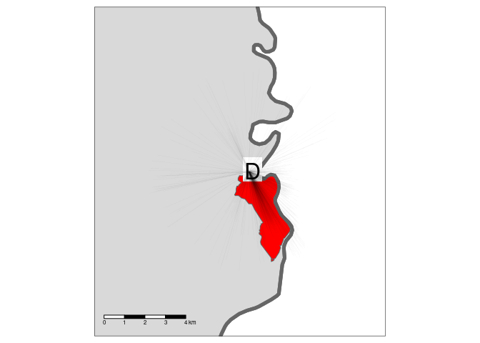

An automated toolset for planning of walking and cycling networks
serving specific destinations
================

<!-- README.md is generated from README.Rmd. Please edit that file -->
<!-- badges: start -->
<!-- badges: end -->
<!-- This repo contains reproducible code to support the analysis of cycling potential in Monmouthshire, Wales. -->
# 1 Introduction

There has been much research on mode shift since the origins of applied
transport planning and modelling in the 1950s (Boyce and Williams 2015;
Aguiléra and Grébert 2014). Within this broad field of research, uptake
of ‘active modes’ (walking and cycling) has become a recent focus
(Götschi et al. 2017). A range of methods have been used to understand
and model walking and cycling levels, with ‘getting people cycling’
being the topic of numerous papers during the 2010 (e.g. Beecham, Wood,
and Bowerman 2012; Grisé and El-Geneidy 2018; Larsen, Patterson, and
El-Geneidy 2013; Raffler, Brezina, and Emberger 2019; Zhang, Magalhaes,
and Wang 2014).
<!-- Todo: Me to insert refs to comparable policy interest in walking (CC) -->

Recent policy interest has been shown in planning active transportation
networks for specific destinations, such as schools and major employers.
Encouraging active travel is not just about network infrastructure but
complete package of policies, promotion, education, incentives,
facilities at destinations (Forsyth and Krizek 2011; Handy, van Wee, and
Kroesen 2014; McCormack and Shiell 2011; Pucher et al. 2010). Within
this context the specific-destination approach allows for more focused
management of the ‘complete package’ as relevant to that destination.
However as modellers we are also keen to ensure that
specific-destination approaches do not neglect integration with the
wider network (Forsyth and Krizek 2011). It is difficult, in planning
practice, to create calibrated models of walking and cycling behaviour,
for the following reasons:

1.  Models of active modes of transportation are underdeveloped compared
    to vehicular models
2.  The small scale of trips makes them sensitive to small scale
    features of the network. These can include: minor streets (often
    excluded from vehicle models altogether yet essential for active
    models); a greater variety of origin/destination points (not only
    zone centroids or a limited set of representative points within each
    zone, as with vehicular models); features such as cycle lane,
    sidewalk and footpath locations and condition, route attractiveness
    (as measured by e.g. green vegetation) and street lighting, none of
    which are reliably mapped.
3.  The case of cycling suffers from an additional challenge, in that
    current levels of uptake are low. It is reasonable to assume that as
    uptake increases, cultural and safety-in-numbers effects may create
    significant nonlinearity in the response of cycling mode share to
    cycling infrastructure, as has already happened in e.g. Holland and
    Denmark, yet we lack the data to calibrate this (Hollander 2016).
4.  Reliable, recent local data on mode choice and flows is often not
    available.
5.  Finally, the funds invested in construction of active transportation
    networks — and hence also in their modelling — are low compared to
    typical spending on vehicular networks and their models.

These challenges notwithstanding, two broad approaches to modelling
cycling uptake have been particularly prominent in the literature.
<!-- Comment from CC: I think better not to categorize Go Dutch as an O_D model here, firstly because we’re not comparing to spatial network analysis, secondly because in context of ‘specific destination’ planning (or whatever we call it) it’s going to get confusing -->
<!-- Maybe better here to explain how Go Dutch addresses point 3 above? -->
<!-- Todo: what did you mean by "This approach" in the tracked changes Crispin? (RL) -->
The *origin-destination approach* relies on estimates of current travel
behaviour, represented in origin-destination datasets reporting the
number of trips, e.g. by mode of travel to work on a typical working day
between residential zone origins and workplace destinations. This
approach was used in the Propensity to Cycle Tool (PCT), which was
originally developed to support strategic cycle network planning based
on commuter data for England (Lovelace et al. 2017). The ‘PCT approach,’
which is a particular implementation of the ‘origin-destination’
approach that models cycling uptake in terms of ‘distance-hilliness
decay’ functions (which can include other explanatory variables such as
traffic levels) has subsequently been adapted to explore cycling
potential in other contexts, including cycling uptake in US cities with
low cycling levels (Ahmad et al. 2020) and the potential for mode shift
to cycling for the ‘school commute’ in across all state schools in
England, with publicly available visualisations down to the street level
(Goodman et al. 2019).

<!-- Here I will introduce spatial network analysis (Chan & Cooper, 2019; Cooper, 2017, 2018). -->

An alternative approach is to use the topology of the transport network
as the basis of modelling using spatial network analysis (SNA)
techniques (Chan and Cooper 2019; C. H. V. Cooper 2018; J. Cooper and
Leahy 2017). Within the context of the above challenges, this paper
introduces an automated toolchain to assist in production of planning
aids for active transportation focused on specific destinations but also
highlighting integration with the wider network. The approach of
automation keeps the expense of deployment realistic for active
transportation budgets. Given the challenges of reliable prediction of
walking and cycling mode choice and flows, the aim at this stage is not
to produce calibrated predictions, but to visualize likely walking and
cycling behaviours within settlements in a manner useful to the planning
process. We do so using reproducible methods and open access input data
to encourage others to employ the techniques in other areas to support
evidence-based interventions to enable cycling uptake and as a basis for
future research and development.

<!-- Should we mention the aim of the paper? Previously it was: (RL) -->
<!-- The aim of this paper is to demonstrate the relative merits of the 'origin-destination approach' implemented in the PCT and the 'spatial network' approach implemented in the open source sDNA software [@chan_using_2019]. -->
<!-- We do so using reproducible methods and open access input data to encourage others to employ the techniques in other areas to support evidence-based interventions to enable cycling uptake and as a basis for future research and development. -->

# 2 Study area and input data

The case study area is the local authority district of Monmouthshire, in
rural South Wales (Figure <a href="#fig:case">2.1</a>). The research
took place in the context of the Welsh Active Travel Act (Welsh
Government 2020).

Figure 2.1: Case study area, with the parishes of Chepstow and
Abergavenny highlighted in red.

The main destinations of interest were schools and leisure centres.
These can be obtained from OpenStreetMap with the tags (key-value pairs)
`amenity=school` and `leisure=sports_centre`.

Other than destinations of interest, the other key input was the
boundary of the region responsible for the transport system in the local
area. <!-- Todo: resolve this comment (CC): -->
<!-- I haven’t buffered in this way – I’m still reluctant to discard out-of-region flows (although I do cut everything off at the severn bridge) -->
<!-- From a data quantity perspective I have fixed a lot of issues in recent automation. Turns out OSM had a lot of pseudonodes leading to much higher link counts than necessary especially after running through my sidewalk tool. These are fixed now.  -->
<!-- We tested two approaches to define the 'area of interest' defining the area within which routes were calculated: a simple buffer and a three-stage buffering process, as illustrated in Figure <a href="#fig:buffers"><strong>??</strong></a>. -->
<!-- The simple buffer approach involved creating polygon with borders a fixed distance (5 km in the first instance) around the destination (in this case the parishes of Chepstown and Abergavenny). -->
<!-- Model run times (and visualisation load times in interactive maps) depend on the amount of data served, creating an incentive reduce the size of the input data, and from a policy perspective, it makes sense to focus on the area over which local planners have control (and budget). -->
<!-- In this context, the three-stage process was developed as follows: -->

<!-- 1. Create a buffer around the zone of interest with a threshold distance (set to 5 km) -->
<!-- 2. Create a separate buffer around the region of interest to allow for some (more limited) inter-regional flow (set to 2 km) -->
<!-- 3. Calculate the intersection between the two buffers outlined in the previous stages -->
<!-- The advantages of the simple buffer approach included simplicity and minimisation of parameters that had to be hard-coded into the analysis.  -->
<!-- Taking both factors into account, we use the simple approach represented in the left hand plot of Figure <a href="#fig:buffers"><strong>??</strong></a>, saving the three stage approach for contexts where it is advantageous to model cross-region flow but also to reduce the proportion of trips modelled crossing regional/state boundaries. -->
<!-- This process is now available as a function, ... in the package stplanr. -->
<!-- # Study area and data -->
<!-- ## Definition of travel watersheds -->
<!-- Explain how extent of analysis was computed (RL + CC) -->

A key input is origin-destination (OD) data. OD data can be obtained
from a number of sources, the most reliable being a list of geocoded
addresses or postcodes associated with people who visit each destination
regularly. In cases where OD datasets derived from from surveys or
official/commercial records are missing, they can be simulated using a
range of techniques. For the purposes of this paper, to enable full
reproducibility, we simulate origins by sampling from buildings in the
study area, as illustrated below.

Figure 2.2: Origin-destination data, represented as ‘desire lines’
emanating from residential origins with the destination fixed to the
destination.

The other key input, for spatial network analysis, is route network
data. This can be obtained from OpenStreetMap, which has global coverage
(although quality varies). The OSM data for the study area is
represented in Figure <a href="#fig:osminput">2.3</a>.

Figure 2.3: OSM data for the study area (placeholder - RL to update)

<!-- ## Estimating cycling uptake -->
<!-- Go Dutch and other options (RL) -->

# 3 Spatial network analysis

Explanation of the method and reproducible example (CC)

## 3.1 Spatial network processing

## 3.2 Network modelling

## 3.3 Scenario analysis

How the walking/cycling scenarios were implemented with sDNA (CC)

# 4 Integrated OD and SNA network analysis

RL + CC

## 4.1 Road network visualisation

# 5 Findings

RL + CC

# 6 Conclusions

RL + CC

# 7 References

Aguiléra, Anne, and Jean Grébert. 2014. “Passenger Transport Mode Share
in Cities: Exploration of Actual and Future Trends with a Worldwide
Survey.” *International Journal of Automotive Technology and Management*
14 (3-4): 203–16. <https://doi.org/10.1504/IJATM.2014.065290>.

Ahmad, Sohail, Anna Goodman, Felix Creutzig, James Woodcock, and Marko
Tainio. 2020. “A Comparison of the Health and Environmental Impacts of
Increasing Urban Density Against Increasing Propensity to Walk and Cycle
in Nashville, USA.” *Cities & Health* 4 (1): 55–65.
<https://doi.org/10.1080/23748834.2019.1659667>.

Beecham, Roger, Jo Wood, and Audrey Bowerman. 2012. “A Visual Analytics
Approach to Understanding Cycling Behaviour.” In *2012 IEEE Conference
on Visual Analytics Science and Technology (VAST)*, 207–8. IEEE.

Boyce, David E., and Huw C. W. L. Williams. 2015. *Forecasting Urban
Travel: Past, Present and Future*. Edward Elgar Publishing.

Chan, Eric Yin Cheung, and Crispin HV Cooper. 2019. “Using Road Class as
a Replacement for Predicted Motorized Traffic Flow in Spatial Network
Models of Cycling.” *Scientific Reports* 9 (1): 1–12.

Cooper, Crispin H. V. 2018. “Predictive Spatial Network Analysis for
High-Resolution Transport Modeling, Applied to Cyclist Flows, Mode
Choice, and Targeting Investment.” *International Journal of Sustainable
Transportation* 0 (0): 1–11.
<https://doi.org/10.1080/15568318.2018.1432730>.

Cooper, Jai, and Terry Leahy. 2017. “Cycletopia in the Sticks: Bicycle
Advocacy Beyond the City Limits.” *Mobilities*, January, 1–17.
<https://doi.org/10.1080/17450101.2016.1254898>.

Forsyth, Ann, and Kevin Krizek. 2011. “Urban Design: Is There a
Distinctive View from the Bicycle?” *Journal of Urban Design* 16 (4):
531–49.

Goodman, Anna, Ilan Fridman Rojas, James Woodcock, Rachel Aldred,
Nikolai Berkoff, Malcolm Morgan, Ali Abbas, and Robin Lovelace. 2019.
“Scenarios of Cycling to School in England, and Associated Health and
Carbon Impacts: Application of the ‘Propensity to Cycle Tool’.” *Journal
of Transport & Health* 12 (March): 263–78.
<https://doi.org/10.1016/j.jth.2019.01.008>.

Götschi, Thomas, Audrey de Nazelle, Christian Brand, Regine Gerike, and
Regine Gerike. 2017. “Towards a Comprehensive Conceptual Framework of
Active Travel Behavior: A Review and Synthesis of Published Frameworks.”
*Current Environmental Health Reports* 4 (3): 286–95.
<https://doi.org/10.1007/s40572-017-0149-9>.

Grisé, Emily, and Ahmed El-Geneidy. 2018. “If We Build It, Who Will
Benefit? A Multi-Criteria Approach for the Prioritization of New Bicycle
Lanes in Quebec City, Canada.” *Journal of Transport and Land Use* 11
(1). <https://doi.org/10.5198/jtlu.2018.1115>.

Handy, Susan, Bert van Wee, and Maarten Kroesen. 2014. “Promoting
Cycling for Transport: Research Needs and Challenges.” *Transport
Reviews* 34 (1): 4–24. <https://doi.org/10.1080/01441647.2013.860204>.

Hollander, Yaron. 2016. *Transport Modelling for a Complete Beginner*.
CTthink!

Larsen, Jacob, Zachary Patterson, and Ahmed El-Geneidy. 2013. “Build It.
But Where? The Use of Geographic Information Systems in Identifying
Locations for New Cycling Infrastructure.” *International Journal of
Sustainable Transportation* 7 (4): 299–317.
<http://www.tandfonline.com/doi/abs/10.1080/15568318.2011.631098>.

Lovelace, Robin, Anna Goodman, Rachel Aldred, Nikolai Berkoff, Ali
Abbas, and James Woodcock. 2017. “The Propensity to Cycle Tool: An Open
Source Online System for Sustainable Transport Planning.” *Journal of
Transport and Land Use* 10 (1). <https://doi.org/10.5198/jtlu.2016.862>.

McCormack, Gavin R., and Alan Shiell. 2011. “In Search of Causality: A
Systematic Review of the Relationship Between the Built Environment and
Physical Activity Among Adults.” *International Journal of Behavioral
Nutrition and Physical Activity* 8 (1): 1–11.

Pucher, John, Ralph Buehler, David R. Bassett, and Andrew L. Dannenberg.
2010. “Walking and Cycling to Health: A Comparative Analysis of City,
State, and International Data.” *American Journal of Public Health* 100
(10): 1986–92. <https://doi.org/10.2105/AJPH.2009.189324>.

Raffler, Clemens, Tadej Brezina, and Günter Emberger. 2019. “Cycling
Investment Expedience: Energy Expenditure Based Cost-Path Analysis of
National Census Bicycle Commuting Data.” *Transportation Research Part
A: Policy and Practice* 121 (March): 360–73.
<https://doi.org/10.1016/j.tra.2019.01.019>.

Welsh Government. 2020. “Active Travel Guidance.” Welsh Government.
<https://gov.wales/sites/default/files/consultations/2020-02/active-travel-guidance_1.pdf>.

Zhang, Dapeng, David Jose Ahouagi Vaz Magalhaes, and Xiaokun (Cara)
Wang. 2014. “Prioritizing Bicycle Paths in Belo Horizonte City, Brazil:
Analysis Based on User Preferences and Willingness Considering
Individual Heterogeneity.” *Transportation Research Part A: Policy and
Practice* 67: 268–78. <https://doi.org/10.1016/j.tra.2014.07.010>.

